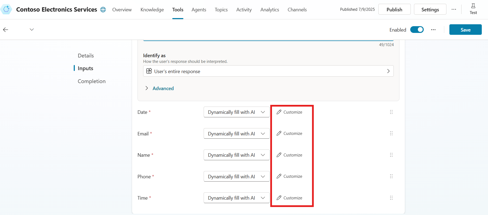
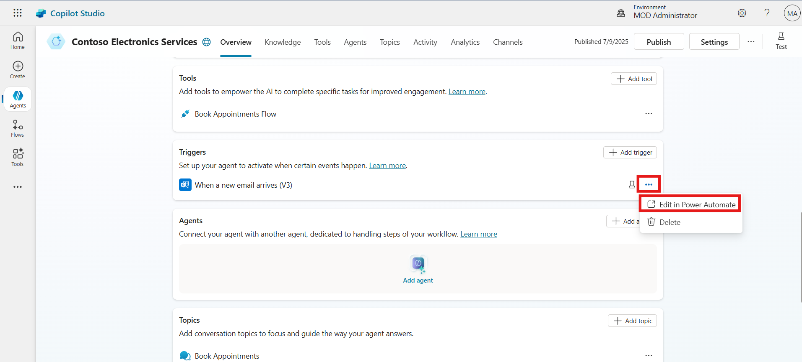
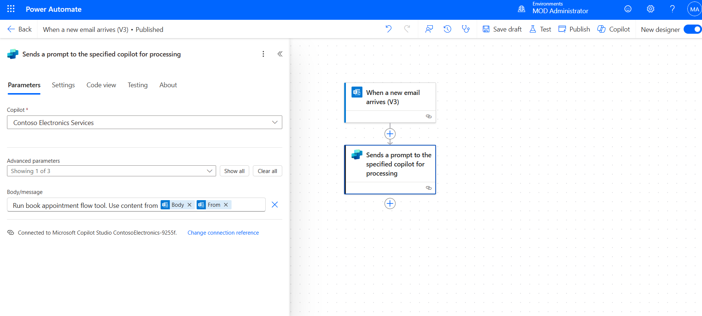

Level-up CSP Technical Training – Power Platform Facilitator Guide

Automating Email-Triggered Appointment Booking Using Agent Flow

Lab Guide for Retail Scenario

[TABLE]

This document is provided “as-is”. Information and views expressed in
this document, including URL and other Internet Web site references, may
change without notice. You bear the risk of using it. 

This document does not provide you with any legal rights to any
intellectual property in any Microsoft product. You may copy and use
this document for your internal reference purposes. 

 

© 2024 Microsoft. All rights reserved.  

**  
**

# Objective & Scenario

## Objective

Enhance the existing Virtual Assistant Agent built for Contoso
Electronics by enabling it to automatically process customer appointment
requests received via email. This extension empowers the agent to
respond to customer emails, extract relevant information, trigger an
appointment flow, and store booking data in Dataverse—creating a
seamless, multichannel support experience.

## Solution Focus Area

Contoso Electronics aims to expand the capabilities of its AI-powered
Virtual Assistant by integrating backend automation that handles
email-based appointment requests. While the first phase focused on
helping customers with product discovery and post-purchase support
through direct interaction, this extended lab addresses:

1.  **Email-to-Agent Automation**: Allowing customers to send
    appointment requests via email and automating their processing using
    Power Automate and Copilot Studio.

2.  **Trigger-Based Workflows**: Building intelligent flows that listen
    to email triggers, invoke prebuilt tools, and update data directly
    in Dataverse.

3.  **Operational Efficiency**: Minimizing manual intervention in
    scheduling assistance appointments and enhancing service
    accessibility for customers who prefer email communication.

This approach bridges the gap between traditional communication (email)
and modern virtual assistant automation, delivering an integrated
omnichannel support experience.

## Persona and Scenario

- **Remy Morris** – Digital Solutions Architect  
  Designs the overall technical architecture and recommends integration
  of email-based automation to streamline customer engagement.

- **Mark Brown** – Project Lead  
  Oversees development and ensures that the agent aligns with Contoso's
  digital transformation goals.

- **David Flores** – App Developer  
  Implements the email trigger, modifies Power Automate flows, and
  integrates them into the Copilot agent.

- **Jane Miller** – App Tester  
  Validates that email inputs trigger the correct flows and data is
  correctly processed and saved.

- **Grady Archie** – Customer (Product Discovery)  
  Schedules an appointment via email to get help finalizing a purchase
  decision on a Surface laptop.

- **Miriam Graham** – Customer (Refund Request)  
  Sends refund-related inquiries and may also schedule a call for
  further assistance using the virtual agent.

## Pre-requisites

To complete this extended lab, participants must have access to the
following:

- Execution of **Lab 2 - Build an Agent for your retail customer
  webpage**

- A **Work, School, or Admin Tenant Email ID and Password**

- A valid **Microsoft Power Apps Free Trial License**

- A valid **Microsoft Power Automate Free Trial License**

- A valid **Microsoft Copilot Studio Free Trial License**

- Previously created **Book Appointment Flow** in Power Automate

- Copilot Agent already configured for Contoso Electronics Services

Note: UI elements may evolve with Microsoft updates, but core automation
concepts and practices remain relevant.

# Lab Instructions

## Exercise 1: Sign In to Copilot Studio

In this exercise, participants will access Copilot Studio using an admin
tenant enabled for Power Apps and Copilot Studio trials. This sets up
the foundational environment required for building and testing
AI-powered agents.

1.  Navigate to <https://copilotstudio.microsoft.com> copilot studio and
    then click on **Sign In**.

> 

2.  Enter your **Admin Tenant Email ID** (trial-enabled for Copilot
    Studio and Power Apps). Then click on the **Next** button to
    proceed.

> 

3.  Enter your **Password**, and click **Sign In**.

> 

4.  Once logged in, make sure you are in the right environment. if not,
    please select the right environment **(MOD Administrator).**

**Conclusion:**

- Successfully signed in to Copilot Studio using an admin tenant.

- Verified and selected the correct environment for agent configuration.

## Exercise 2: Add and Configure Agent Flow as a Tool in Copilot

This exercise walks participants through the process of integrating a
prebuilt Power Automate flow as a tool within a Copilot agent, allowing
dynamic interaction with user input.

1.  Navigate to **Contoso Electronics Services agent.** From top menu
    bar click on the **Tools** option. Then click on the **+ Add tool**
    option.

2.  From the tool types, select **Flow**. Choose the previously created
    flow named **Book Appointment Flow**.

3.  Click **Add to agent** to finalize the addition of the tool.

4.  In the Tools section, click on the newly added Book Appointment
    tool.

5.  Scroll down to the Inputs section. Click on Customize next to each
    field and update the descriptions for better clarity:

- Type: "Enter the type of the appointment from the input"

- Email: "Enter the email from the input"

- Name: "Enter the name from the input"

- Date: "Enter the Date from the input"

- Time: "Enter the appointment time from the input"

- Phone: "Enter the phone number from the input"

> 
>
> 
>
> 

6.  After customizing all inputs, click the **Save** button to retain
    the configuration.

**Conclusion:**

- Added the prebuilt Book Appointment flow as a tool in the Copilot
  agent.

- Customized input fields for clarity and accurate data mapping.

- Saved the tool configuration for future use by the agent.

## Exercise 3: Add a Trigger Based on Incoming Email

Participants configure a trigger that enables the Copilot agent to react
when a new email arrives in the inbox, setting the stage for automated
workflows.

1.  Navigate back to the **Overview** section of the Copilot agent.

2.  Scroll down to the **Trigger** section and click **+ Add trigger**.

> 

3.  From the list of trigger types, choose **When a new email arrives**.

> 

4.  Click **Next** to configure the trigger.

> 

5.  In the folder selection field, click the folder icon and select
    **Inbox**.

6.  This setting ensures the trigger activates when a new email lands in
    the Inbox.

> 

7.  Click **Create trigger** to finalize the setup.

> 

8.  Once created, click **Close** to return to the overview.

> 

**Conclusion:**

- Configured a new email-based trigger for the Copilot agent.

- Set the trigger to monitor the Inbox folder.

- Enabled automated agent response upon receiving an email.

## Exercise 4: Customize the Trigger in Power Automate

This exercise focuses on customizing the email-based trigger using Power
Automate to properly interpret and pass incoming data to the Copilot
agent.

1.  In the Trigger section, locate the recently added trigger.

2.  Click on the horizontal ellipsis (…) icon and select Edit in Power
    Automate.

3.  Click on the "When a new email arrives" trigger action.

4.  Click the Settings option inside this action and enable the Split On
    option.

5.  In the Array field, select “@triggerOutputs()?\['body/value'\]”.

6.  Click on the "Send a prompt to specified Copilot" action.

7.  Replace its default body/message with the following content:

Run book appointment flow tool. Use content from
@{triggerOutputs()?\['body/body'\]}@{triggerOutputs()?\['body/from'\]}

8.  Click Save Draft, and then click Publish to activate the changes.

**Conclusion:**

- Edited the trigger in Power Automate to support email array
  processing.

- Enabled Split On for handling multiple email items.

- Customized the Copilot message with dynamic content references.

- Published the updated trigger logic for production use.

## Exercise 5: Trigger the Flow with an Incoming Email

Participants simulate the trigger event by sending a test email to
verify if the configured automation properly initiates and processes
user information for appointment booking.

1.  After publishing, click on **Test** from the top bar.

> 

2.  Choose **Manually**, then click **Test** again to activate manual
    testing.

> 
>
> 

3.  In a separate tab, open <https://outlook.office.com> and log in with
    a **personal account**.

4.  Send an email to the **Admin Tenant Email** used to build the agent.
    Use the content below:

[TABLE]

> 

5.  Wait for a few seconds. The trigger will detect the email, run the
    flow, and initiate the appointment tool.

> 

**Conclusion:**

- Sent a test email to the configured admin tenant account.

- Verified that the email triggered the Copilot flow successfully.

- Confirmed that the appointment tool was invoked automatically.

## Exercise 6: Test the Agent’s Response to Email

In this final exercise, participants confirm whether the Copilot agent
correctly extracted data from the test email and stored the appointment
information in the Dataverse table.

1.  Go back to **Copilot Studio** and open the **Overview** section of
    the agent.

2.  Scroll down to the **Trigger** section and click the **Test** icon.

> 

3.  Select the most recent test case and click **Start Testing**.

> 

4.  Observe how Copilot processes the email data and automatically fills
    in appointment fields using the tool.

5.  Confirm that the information was extracted correctly and passed to
    the Dataverse table.

> 

6.  To confirm the testing, open Power Apps, navigate to the **Book
    Appointments** table in Dataverse, and verify that the appointment
    details shared in the test email—such as name, type, date, time,
    phone, and email—have been automatically captured and stored without
    any manual entry.

**Conclusion:**

- Tested agent behavior using the previously received email.

- Verified accurate data extraction and field mapping by the agent.

- Confirmed successful data insertion into the Book Appointments
  Dataverse table.
