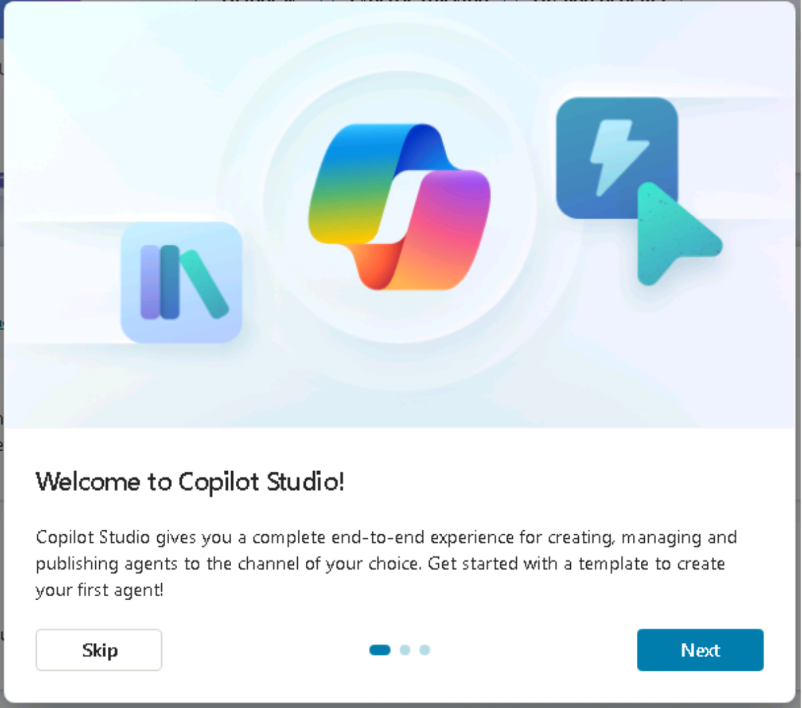
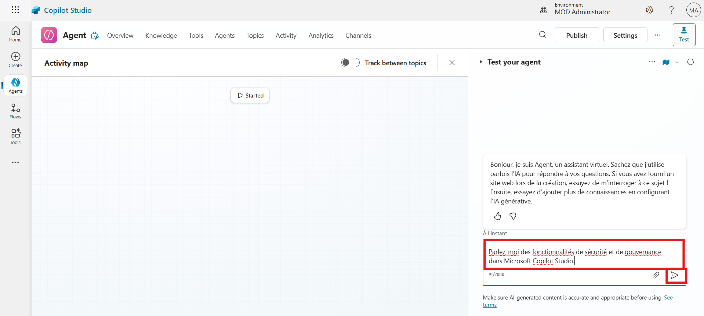

Level-up CSP Technical Training – Power Platform Facilitator Guide

Building and Publishing Multilingual Agents in Microsoft Copilot Studio

[TABLE]

This document is provided “as-is”. Information and views expressed in
this document, including URL and other Internet Web site references, may
change without notice. You bear the risk of using it. 

This document does not provide you with any legal rights to any
intellectual property in any Microsoft product. You may copy and use
this document for your internal reference purposes. 

 

© 2024 Microsoft. All rights reserved.  

## Exercise 1: Accessing Microsoft Copilot Studio

In this exercise, you will begin by accessing Microsoft Copilot Studio,
the platform where you will create and manage AI-powered copilots.
Depending on your participation on Day 1 and your trial license status,
you will either proceed with signing in directly or start a free trial.
This setup ensures you have access to the correct environment—MOD
Administrator—which will be used throughout the lab. Completing this
step is essential before you can begin building or managing any
copilots.

**Note:** If you attended Day 1 and have already activated the free
trial of Copilot Studio, please complete Task 2 and skip Task 1. If you
did not attend Day 1 and do not have a Copilot Studio free trial
license, please skip Task 2 and complete Task 1.

### Task 1: Start Free Trial Copilot Studio

1.  Open a Microsoft Edge new tab and navigate to copilot studio
    website https://www.microsoft.com/en-us/microsoft-copilot/microsoft-copilot-studio
    and select the Try free.

2.  In the Email box, enter admin tenant and then select Next.

3.  Select Sign In.

4.  If prompted, in the Password box, enter admin tenant password and
    then select Sign in.

If you are prompted with a message stating You already have a license
for Microsoft Copilot Studio, select Get Started.

5.  Enter Country or Region and Business phone number in the respected
    fields. Select the check box and select Get started button.

6.  In the confirmation section again select the Get Started button. In
    the Welcome to Microsoft Copilot Studio dialog box, select Skip.

7.  Once you're signed in, look at the top-right corner of the screen.
    Choose the environment, we use MOD Administrator environment for
    this lab. This is important for the next steps, as you'll need to
    select this environment when working in Power Apps.

**Caution: If you don't see Mod Administrator follow these steps**

**Steps to Create a New Power Platform Environment if you don't have
"Mod Admin"**

1)  Open edge browser and navigate
    to https://admin.powerplatform.microsoft.com (Power Platform admin
    center). Enter given below admin tenant in the field and then select
    the Next button to proceed.

> 

2)  Enter Admin Password in the field and select the Sign in.

> 

3)  Select the Yes to stay signed in.

> 

4)  From the left menu, select Manage, participant navigate to
    environments page, then select + New to create a new environment.

> 

5)  In the Name field, type MOD Administrator. Select "Developer" as the
    environment type and select Next.

> 

6)  Choose your preferred language (for this lab guide, we are
    using English) and turn "Yes" for "Deploy sample apps and
    data." Select Save to begin the environment creation process.

> 

7)  Wait a few minutes until the environment status displays Ready.

> 

8)  Navigate back to copilot studio and select Mod Administrator
    Environment.

> 

### Task 2: Sign In to Microsoft Copilot Studio (For Participants with Active Trial) 

1.  Open a Microsoft Edge new tab and navigate to copilot studio
    website https://www.microsoft.com/en-us/microsoft-copilot/microsoft-copilot-studio
    and select the Sign in from top right corner.

2.  Enter Admin Tenant ID in the field and then click on the Next button
    to proceed.

3.  Enter Admin Password in the respected field and Click on the Sign in
    button.

4.  Click on the Yes button to stay signed in.

5.  Once you're signed in, look at the top-right corner of the screen.
    Choose the environment, we use MOD Administrator environment for
    this lab. This is important for the next steps, as you'll need to
    select this environment when working in Power Apps.

### Conclusion 

1.  Learned how to sign in to Microsoft Copilot Studio using an existing
    trial license

2.  Understood how to start a free trial for Copilot Studio if not
    already activated

3.  Identified how to switch to or create the “MOD Administrator”
    environment

4.  Gained experience navigating both Copilot Studio and Power Platform
    Admin Center

5.  Ensured the correct setup needed for building and testing copilots
    in upcoming exercises

## Exercise 2: Create a Copilot Studio Learning Agent

In this exercise, participants will learn how to create a new agent in
Microsoft Copilot Studio using a custom prompt. This agent will serve as
a learning assistant to help users navigate various Copilot Studio
capabilities.

1.  From the left-hand menu, navigate to **Agents** and click on **+ New
    agent**.

> 

2.  From right hand side, participants can change the primary language
    of the agent. For this lab guide using **English** as primary
    languages.

> 

3.  In the **prompt input field**, paste the following prompt and then
    click on the **Execute** button to run the prompt.

Create a virtual agent that serves as a comprehensive learning assistant
for Copilot Studio. The agent should guide users through all aspects of
Copilot Studio, including getting started, key features, licensing,
agent creation, publishing, integration, advanced capabilities (e.g.,
generative answers, APIs), and best practices. The agent must support
FAQs, provide interactive guidance, and recommend official Microsoft
resources, documentation, and learning paths. It should be
user-friendly, accessible to both beginners and advanced users, and
capable of answering contextual follow-up questions.

4.  Type **Confirm** in the field and click **Execute**.

> 

5.  Click the **Create** button from the top-right corner to generate
    the agent.

> 

### Conclusion

- Created a new virtual agent using a detailed natural language prompt.

- Chose **English** as the agent’s default language.

- Executed and confirmed prompt to create the agent in Copilot Studio.

## Exercise 2: Add Knowledge Source to the Agent

This exercise guides participants in enriching the agent’s responses by
connecting it to a live Microsoft documentation website using the
knowledge source feature.

1.  On the agent overview page, scroll down and click **+ Add
    knowledge**.

> 

2.  Choose **Public Website** as the knowledge source type.

> 

3.  In the URL field, enter
    <https://learn.microsoft.com/en-us/microsoft-copilot-studio> and
    then click on the **Add** button.

> 

4.  After adding URL, Click **Add to agent** button to proceed.

> 

### Conclusion

- Successfully linked a **public documentation site** to the agent.

- Enabled the agent to provide richer and more accurate responses.

- Integrated **Microsoft Learn** content into the Copilot Studio agent.

## Exercise 3: Enable Multilingual Support and Publish Agent

This final exercise enables multilingual support for the agent by adding
French as a secondary language, uploading localization files, and
publishing the agent.

1.  Navigate back to the **Agent Overview** page. Go to **Settings**
    from top menu bar.

> 

2.  From the setting menu navigate to languages section. First option is
    for primary languages, participants can change the primary language.
    For this lab guide we are using English as primary language.

> 

3.  Click **+ Add language** to add secondary language.

> 

4.  Search for **French (France)**, Select check box of the language and
    then click on the **Add**.

> 

5.  After adding the secondary language, click on the **Upload** button
    to add localization file.

> 

6.  Click **Download localization file** (JSON format) to download file.

> 

7.  The localization file is downloaded successfully and its available
    in the VM downloads folder. Participant need to update the
    localization file in French. For this lab guide we already updated
    the localization file and added in the lab file folder.

8.  Click **Browse**, select the localization_FR file, and click
    **Open**.

9.  Click **Upload translation updates**, then For confirmation click
    **Upload localization** again.

10. Then click on the **Close** button.

> 

11. Return to **Agent Overview** and click **Publish** from the top bar.

> 

12. Confirm by clicking **Publish** again.

> 

### Conclusion

- Added **French** as a secondary language for the agent.

- Uploaded a **custom localization file** using JSON format.

- Published the agent and validated its functionality in **both English
  and French**.

## Test the Agent

1.  In the test window, type:

Tell me about the security and governance features in Microsoft Copilot
Studio.

Observe English response.

2.  Switch to French:

    - From top of the test window, click **ellipsis icon,** navigate to
      **Languages** and then select **French (France)**.

> 

- Type below given prompt in the text field and then click on the
  **Execute** button.

> Parlez-moi des fonctionnalités de sécurité et de gouvernance dans
> Microsoft Copilot Studio.
>
> 
>
> Observe French response.
>
> 

## Final Lab Conclusion: Building and Publishing a Multilingual Copilot Studio Agent

By completing this lab, participants have gained hands-on experience in
setting up and working with Microsoft Copilot Studio. The key outcomes
include:

1.  **Environment Setup**

    - Successfully accessed or activated a Microsoft Copilot Studio
      trial.

    - Created or switched to the “MOD Administrator” Power Platform
      environment.

2.  **Agent Creation**

    - Built a comprehensive learning assistant agent using a custom
      natural language prompt.

    - Configured the agent with English as the primary language.

3.  **Knowledge Integration**

    - Connected a live Microsoft Learn documentation URL as a knowledge
      source.

    - Enabled the agent to respond with context-rich and accurate
      information.

4.  **Multilingual Enablement & Publishing**

    - Added French as a secondary language and uploaded a custom JSON
      localization file.

    - Published the agent, making it available in both English and
      French.

5.  **Testing & Validation**

    - Verified agent responses in both languages, ensuring multilingual
      functionality works as expected.

This lab equips participants with foundational Copilot Studio skills,
including environment setup, agent creation, multilingual configuration,
and real-time testing—preparing them for more advanced AI assistant
development scenarios.
