# 

Level-up CSP Technical Training – Power Platform Facilitator Guide  
Creating a Copilot Studio Agent for Level Up CSP Trainings

[TABLE]

This document is provided “as-is”. Information and views expressed in
this document, including URL and other Internet Web site references, may
change without notice. You bear the risk of using it.

This document does not provide you with any legal rights to any
intellectual property in any Microsoft product. You may copy and use
this document for your internal reference purposes.

© 2024 Microsoft. All rights reserved.

# **Objective & Scenario**

**Objective**

Develop a dedicated **Copilot Studio Virtual Assistant Agent** for Level
Up CSP to help participants seamlessly register for trainings, access
event-related information, and resolve session-related queries. The
agent will serve as an intelligent support companion—assisting users
throughout the event lifecycle, from registration to accessing session
recordings and announcements.

**Solution Focus Area**

The **Level Up CSP** program offers instructor-led sessions, bootcamps,
and hands-on labs to help Microsoft partners and professionals upskill
on cloud technologies, solution selling, and product integration.
However, with increasing training sessions and a growing participant
base, users face difficulty in managing the registration process and
staying updated on new sessions or materials.

Currently, two key challenges exist:

1.  **Training Registration Confusion**: Attendees find it hard to
    identify, register, and confirm their participation in CSP training
    and bootcamp events.

2.  **Disjointed Information Access**: Participants often miss out on
    updates, session recordings, or key resources, as there’s no unified
    support assistant.

To address this, a **Copilot Studio Agent** will be deployed. This
AI-powered agent will act as a one-stop training assistant, integrated
with a CSP knowledge base and capable of handling registrations,
answering questions, and sharing announcements and
materials—dramatically improving the learner experience.

**Persona and Scenario**

- **Remy Morris** – Digital Solutions Architect

- **Mark Brown** – Project Lead

- **David Flores** – App Developer

- **Jane Miller** – App Tester

- **Grady Archie** – Training Attendee (New User)

- **Miriam Graham** – Training Attendee (Follow-up Support)

&nbsp;

- **Remy Morris**, a Digital Solutions Architect, outlines the
  architecture for a Copilot-powered training assistant to support the
  Level Up CSP initiative. He proposes the idea to **Mark Brown**, the
  project lead, who approves the project and assigns it to the
  development team.

- **Mark Brown** tasks **David Flores**, the app developer, with
  building the agent using Microsoft Copilot Studio. David logs in with
  admin credentials, enters the appropriate prompt descriptions, and
  integrates a knowledge base URL that contains session schedules, FAQs,
  and training links.

- Once the assistant is created, **Jane Miller** performs a round of
  tests to ensure the agent responds correctly to user prompts like
  "Register for training" or "Get session recording." She validates the
  integration with the knowledge source and confirms that user
  instructions are clear and consistent.

- The agent is deployed, and **Grady Archie**, a participant, visits the
  training portal to learn about upcoming bootcamps. He uses the agent
  to register for a “Copilot Studio Hands-On Lab” session. The agent
  provides him with a registration confirmation, session overview, and a
  link to join the community group.

- Meanwhile, **Miriam Graham**, who missed a session, returns to the
  site and uses the agent to ask, “Where can I find session recordings?”
  The agent pulls data from the knowledge base and offers a direct link
  to the recording, along with related notes and key highlights.

**Pre-requisites**

- Work or Admin Tenant Email ID and Password

- Microsoft Copilot Studio Free Trial License

- CSP Knowledge Source URL
  https://cloudpartners.transform.microsoft.com/level-up-csp-training

- Supported Web Browser Microsoft Edge

**Note:** The UI of Microsoft Copilot Studio and its agent creation
tools may change as the platform evolves. However, the lab's core
logic—creating an agent, assigning capabilities, and connecting to
knowledge sources—remains the same. Focus on understanding the
underlying concepts so you can adapt to future enhancements with
confidence.

Lab Instructions

## Exercise 1: Sign In and Launch Copilot Studio

Access the Microsoft Copilot Studio environment using the admin account
and prepare to create a new agent.

1.  Navigate to <https://www.microsoft365.com/copilot>.

2.  Click on the email field and enter the **admin tenant ID**, then
    click **Next**.

> 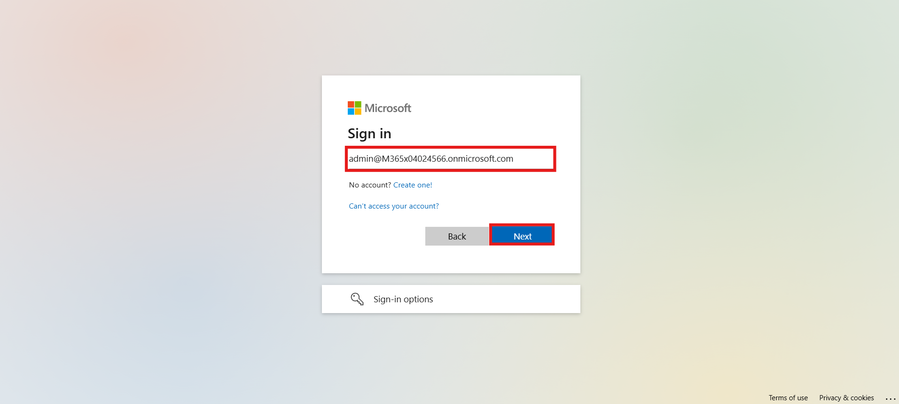

3.  Enter the **admin password**, then click **Sign In**.

> 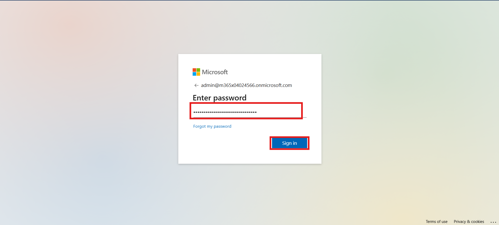

4.  Click **Yes** when prompted to stay signed in.

> 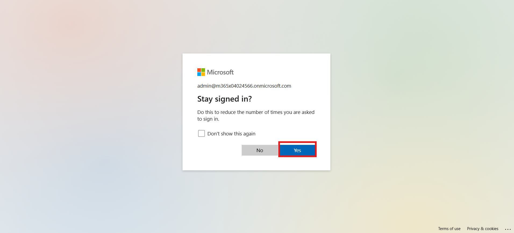

**Conclusion**

You have successfully signed into the Microsoft Copilot Studio
environment using an admin account and are ready to begin agent
creation.

## Exercise 2: Create a New Agent with Prompt

Use the prompt-based approach to create a new Copilot Studio agent
tailored for Level Up CSP support.

1.  Click on **Create an agent** on the left-hand side panel.

> 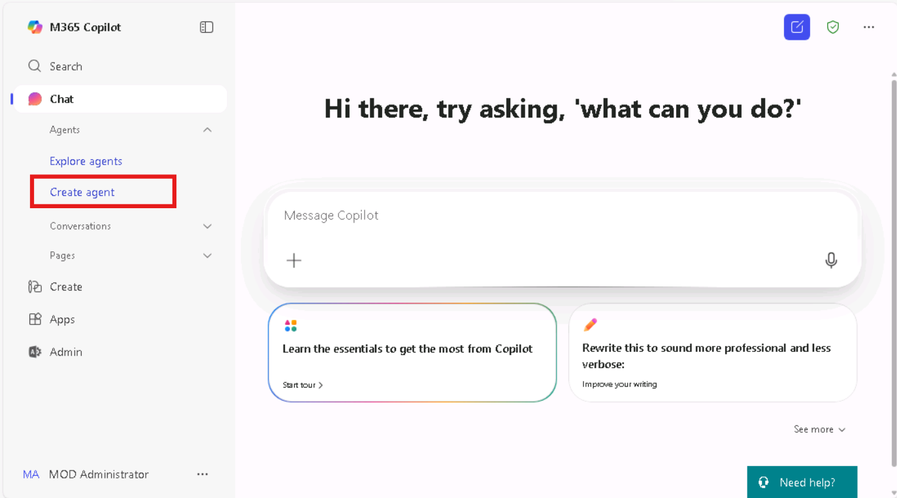

2.  In the text field, enter the following **description prompt**, then
    click **Execute**:

> An agent that assists attendees with registering for and participating
> in Level Up CSP trainings and bootcamps by providing information,
> guiding them through the registration process, and offering support
> for any session-related issues.
>
> 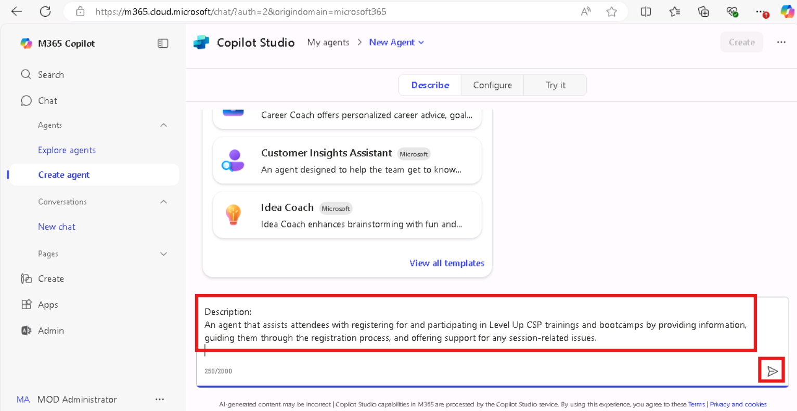

3.  When prompted, enter **Confirm** in the text field and click
    **Execute**.

> 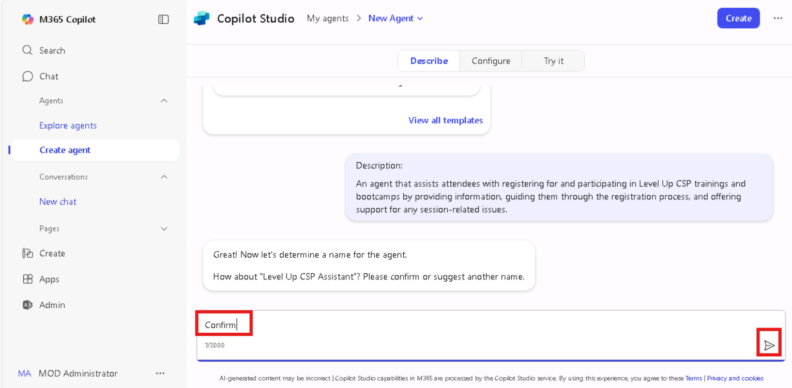

4.  Next, enter the following **instructions prompt**, then click
    **Execute**:

    1.  Assist attendees in registering for Level Up CSP trainings and
        bootcamps.

    2.  Provide information about upcoming events.

    3.  Help with any related queries.

    4.  Share updates on upcoming trainings.

    5.  Provide access to session recordings.

    6.  Guide users through the training registration process.

    7.  Facilitate joining relevant groups.

    8.  Share news and announcements about Level Up CSP programs.

    9.  Trainings may include topics such as agent building, agent
        governance, Copilot Studio, hands-on labs, and more.

    10. Ensure all information is clear and concise.

> 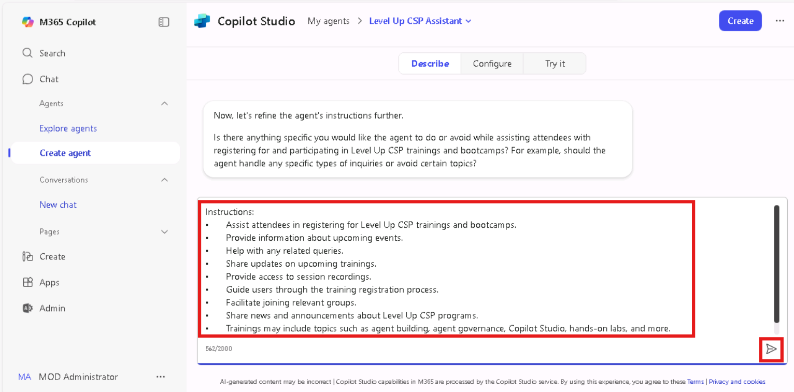

5.  When asked to refine, enter **No** and click **Execute**.

> 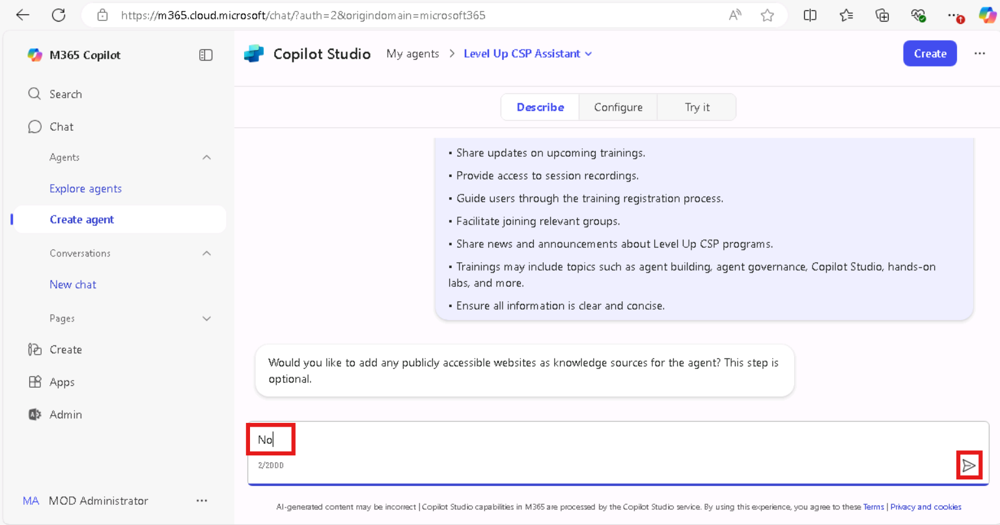

6.  From the top-right corner, click **Create**, then click **Execute**
    to generate the agent.

> 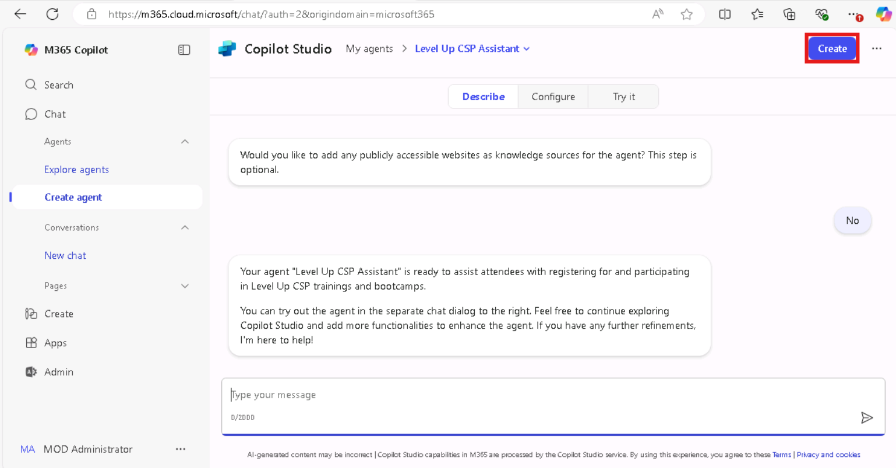

7.  Once created, click **Go to agent** to navigate into the agent
    dashboard.

> 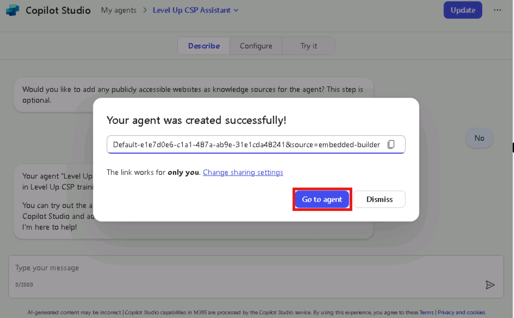

**  
**

**Conclusion**

You have successfully created a Copilot Studio agent for the Level Up
CSP training program using prompt-based design. The agent is now ready
for knowledge enrichment.

## Exercise 3: Add Knowledge Base to the Agent

Enhance the agent by connecting it to a relevant knowledge source for
dynamic content responses.

1.  On the **Level Up CSP Agent** card, click the **ellipsis (⋯)** icon
    and choose **Edit**.

> 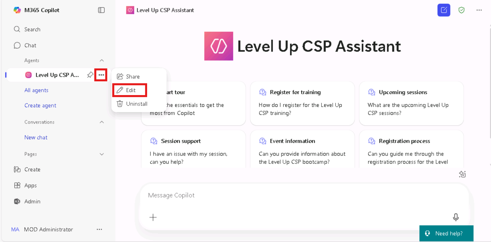

2.  Scroll to the **Configure** section and locate the **Knowledge**
    field.

3.  Enter the following URL and press Enter:

> <https://cloudpartners.transform.microsoft.com/level-up-csp-training>
>
> 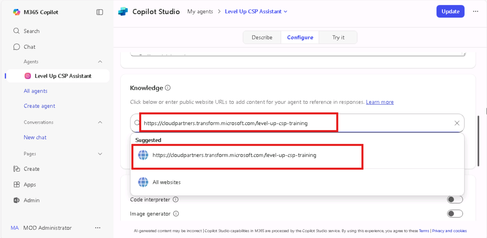

4.  Click the **Update** button to save the configuration.

> 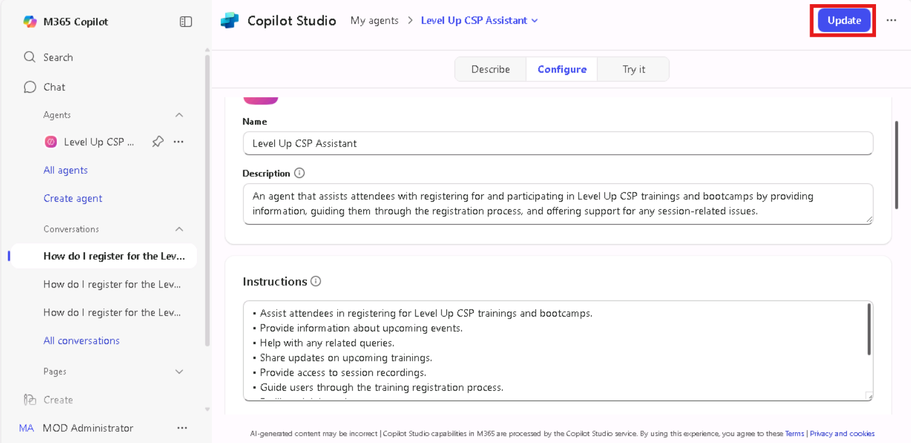

5.  Click **Go to agent** again to return to the agent interface.

> 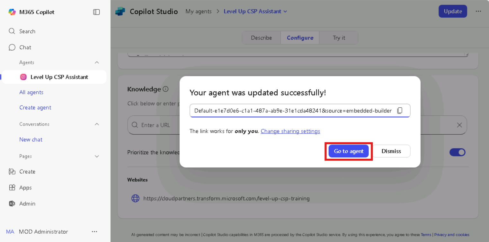

**Conclusion**

You have successfully configured your Copilot agent with a knowledge
base URL that contains training and event-related content for Level Up
CSP.

## Exercise 4: Test the Agent Response

Validate that the agent responds appropriately to a user prompt using
the configured knowledge.

1.  From the agent interface, click on the **Suggested Prompt** titled
    “Register for training.”

> 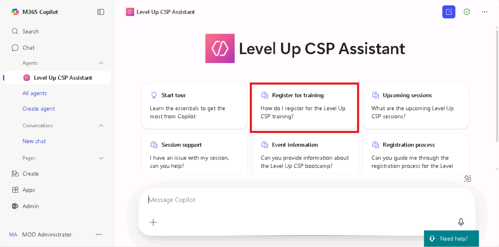

2.  Click the **Execute** button to run the prompt.

> 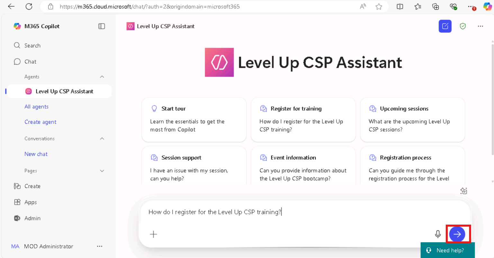

3.  Observe the agent’s response, which should provide information on
    the training registration process.

> 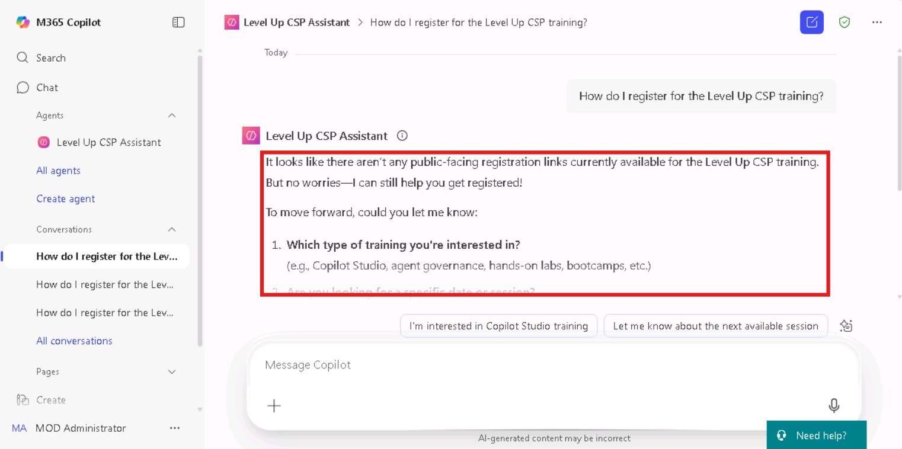

**Conclusion**

You have successfully tested your Copilot agent, confirming that it
provides accurate and contextual responses based on the embedded
training knowledge.

## Final Lab Outcome

By completing this lab, you’ve learned how to:

- Access and sign in to Copilot Studio.

- Create a custom agent using descriptive prompts and instructions.

- Integrate an external knowledge base into the agent configuration.

- Test the agent’s ability to handle training-related queries.

This foundational setup prepares you to build scalable and informative
agents for internal or external support scenarios using Microsoft
Copilot Studio.
