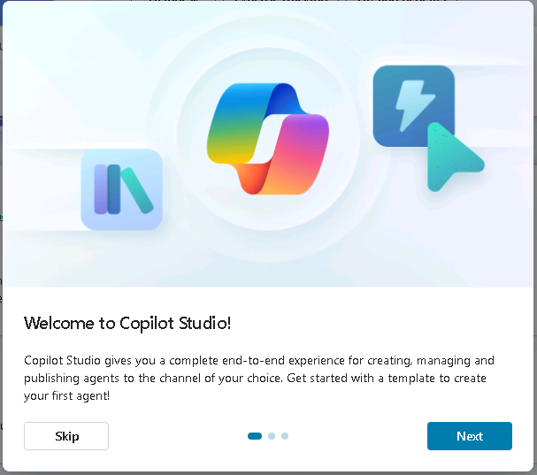
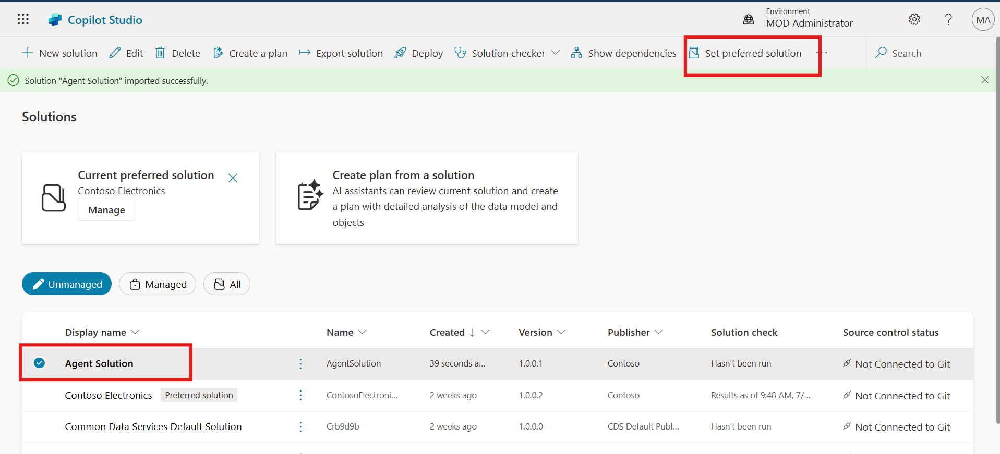
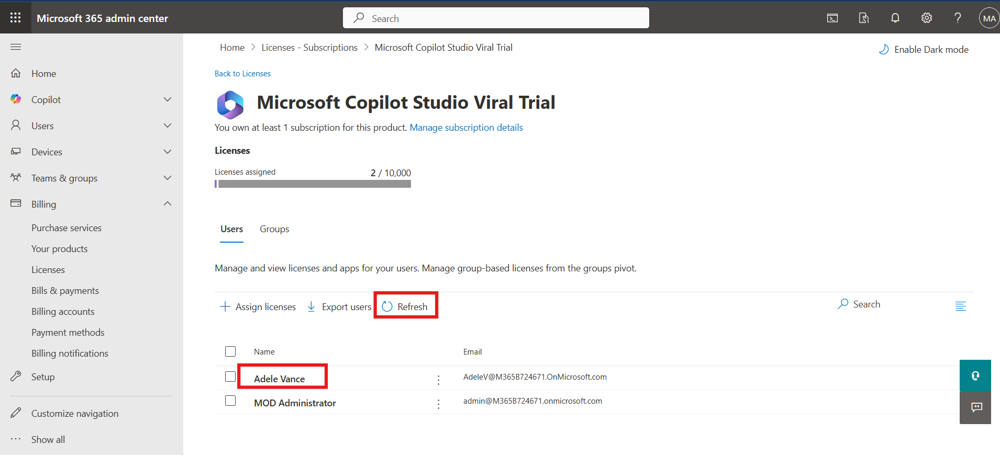
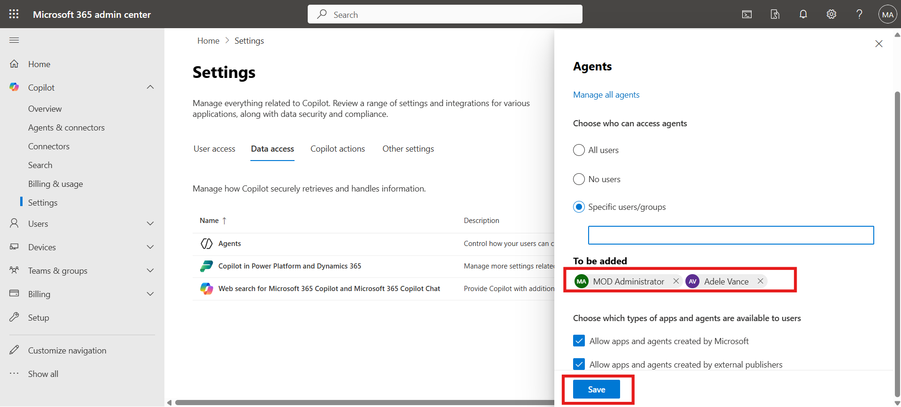
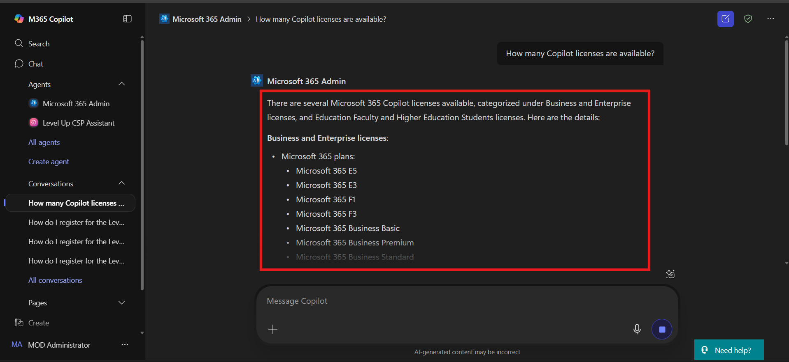
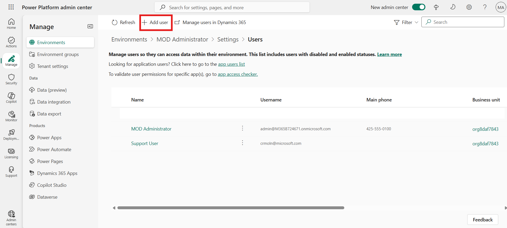

Level-up CSP Technical Training – Power Platform Facilitator Guide

Enterprise Governance and Deployment of Microsoft Copilot Studio Agents

[TABLE]

This document is provided “as-is”. Information and views expressed in
this document, including URL and other Internet Web site references, may
change without notice. You bear the risk of using it. 

This document does not provide you with any legal rights to any
intellectual property in any Microsoft product. You may copy and use
this document for your internal reference purposes. 

 

© 2024 Microsoft. All rights reserved.  

# **Objective & Scenario**

### Objective

Establish a secure, governed Microsoft Copilot Studio environment to
enable enterprise-grade virtual agent development, licensing, access
control, and deployment readiness within Contoso Electronics.
Participants will configure user roles, set up environments, manage
agents, and validate agent performance through Microsoft 365 integration
and Power Platform governance tools.

### Solution Focus Area

Contoso Electronics is undergoing a digital transformation initiative to
enhance internal productivity, streamline customer-facing AI solutions,
and govern agent lifecycle management effectively. The IT operations
team has been tasked with deploying Microsoft Copilot Studio in a way
that ensures:

1.  **Licensing and Access Control:** Only authorized users and groups
    can access, create, and manage Copilot Studio agents.

2.  **Secure and Scalable Deployment:** Agents are deployed in the right
    environments with appropriate role-based access and restricted
    sharing permissions.

3.  **Governance and Compliance:** The organization must enforce data
    security policies, manage environment sharing, and prevent
    unauthorized guest access.

Currently, Contoso faces key challenges:

- Trial licenses are inconsistently assigned to development users.

- Agents are being developed in unmanaged or incorrect environments.

- No consistent process is in place to share, export, or govern agent
  solutions across departments.

To address these challenges, the Contoso IT and digital innovation teams
will use Microsoft Copilot Studio, Microsoft 365 Admin Center, and the
Power Platform Admin Center to ensure agents are securely deployed,
properly licensed, and ready for collaborative development. This lab
provides a hands-on experience to simulate that enterprise readiness.

**  
**

### Pre-requisites

To complete this lab, participants will need the following:

- Access to pre-configured lab files (AgentSolution.zip)

**Note:** The UI of Copilot Studio, Power Platform Admin Center, and
Microsoft 365 Admin Center may evolve. Regardless of interface changes,
the foundational steps for licensing, agent sharing, governance, and
deployment remain consistent.

## Exercise 1: Accessing Microsoft Copilot Studio

In this exercise, you will begin by accessing Microsoft Copilot Studio,
the platform where you will create and manage AI-powered copilots.
Depending on your participation on Day 1 and your trial license status,
you will either proceed with signing in directly or start a free trial.
This setup ensures you have access to the correct environment—**MOD
Administrator**—which will be used throughout the lab. Completing this
step is essential before you can begin building or managing any
copilots.

**  
Note:** If you **attended Day 1** and have already **activated the free
trial of Copilot Studio**, please **complete Task 1** and **skip Task
2**. If you **did not attend Day 1** and **do not have a Copilot Studio
free trial license**, please **skip Task 1** and **complete Task 2**.

### Task 1: Sign In to Microsoft Copilot Studio (For Participants with Active Trial) 

1.  Open a Microsoft Edge new tab and navigate to copilot studio
    website <https://www.microsoft.com/en-us/microsoft-copilot/microsoft-copilot-studio>
    and select the **Sign in** from top right corner**.**

2.  Enter **Admin Tenant ID** in the field and then click on the
    **Next** button to proceed.

3.  Enter **Admin Password** in the respected field and Click on the
    **Sign in** button.

4.  Click on the **Yes** button to stay signed in.

5.  Once you're signed in, look at the top-right corner of the screen.
    Choose the environment, we use **MOD Administrator** environment for
    this lab. This is important for the next steps, as you'll need to
    select this environment when working in Power Apps.

### Task 2: Start Free Trial and Set Up Environment (For New Users Without Active Trial)

1.  Open a Microsoft Edge new tab and navigate to copilot studio
    website <https://www.microsoft.com/en-us/microsoft-copilot/microsoft-copilot-studio>
    and select the **Try free.**

2.  In the **Email** box, enter **admin tenant** and then
    select **Next**.

3.  Select **Sign In**.

4.  If prompted, in the **Password** box, enter admin tenant
    password and then select **Sign in**.

> If you are prompted with a message stating **You already have a
> license for Microsoft Copilot Studio**, select **Get Started**.
>
> 

5.  Enter **Country or Region** and **Business phone number** in the
    respected fields. Select the check box and select **Get
    started** button.

> 

6.  In the confirmation section again select the **Get Started** button.
    In the **Welcome to Microsoft Copilot Studio** dialog box,
    select **Skip**.

> 

6.  Once you're signed in, look at the top-right corner of the screen.
    Choose the environment, we use **MOD Administrator** environment for
    this lab. This is important for the next steps, as you'll need to
    select this environment when working in Power Apps.

**Caution: If you don't see Mod Administrator follow these steps**

> **Steps to Create a New Power Platform Environment if you don't have
> "Mod Admin"**

1.  Open edge browser and navigate
    to https://admin.powerplatform.microsoft.com (Power Platform admin
    center). Enter given below **admin tenant** in the field and then
    select the **Next** button to proceed.

> 

2.  Enter **Admin** **Password** in the field and select the **Sign
    in.**

> 

3.  Select the **Yes** to stay signed in.

> 

4.  From the left menu, select **Manage**, participant navigate to
    environments page, then select **+ New** to create a new
    environment.

> 

5.  In the Name field, type **MOD Administrator**.
    Select **"Developer"** as the environment type and select **Next**.

> 

6.  Choose your preferred language (for this lab guide, we are
    using **English**) and turn **"Yes"** for **"Deploy sample apps and
    data."** Select **Save** to begin the environment creation process.

> 

7.  Wait a few minutes until the environment status displays Ready.

> 

8.  Navigate back to copilot studio and select **Mod Administrator
    Environment**.

### Conclusion

- Learned how to sign in to Microsoft Copilot Studio using an existing
  trial license

- Understood how to start a free trial for Copilot Studio if not already
  activated

- Identified how to switch to or create the “MOD Administrator”
  environment

- Gained experience navigating both Copilot Studio and Power Platform
  Admin Center

- Ensured the correct setup needed for building and testing copilots in
  upcoming exercises

## Exercise 2: Import and Export a Copilot Studio Agent Solution 

### Task 1: Import Agent into Copilot Studio

1.  In Microsoft Copilot Studio, click on **Agents** from the left-hand
    menu and then click on the **Import Agent**

2.  In the top menu bar, click **Import** **solution**.

3.  Click the **Browse** button and navigate to the Lab Files folder on
    the virtual machine.

4.  Select the **AgentSolution** lab file, click on the **Open** button
    and click **Next** to proceed.

5.  Click the **Import** button to import the agent solution.

6.  After successful import, select the newly imported agent solution.

7.  Click **Set preferred solution** from the top bar.

8.  Click **Apply** to confirm the selected solution.

### Task 2: Export Agent from Copilot Studio

1.  Navigate to the **Agents** section. Click the **ellipsis (...)**
    icon on the **Contoso Agent** and select **Export Agent**.

> 

2.  In the **Agent Solution**, click the **ellipsis (...)** icon again
    and select **Export solution**.

> 

3.  Click **Next** to proceed.

> 

4.  Select the **Unmanaged** option and then click on the **Export**
    button.

> 

5.  Once the export is complete, click on the **Download** button from
    the top. The agent will be downloaded to the **Downloads** folder in
    the VM.

> 

### Task 3: Share Agent with Another User

1.  Click on the **ellipsis (...)** icon on the **Contoso Agent** and
    select **Share**.

> 

2.  In the **New User** field, enter **Adele Vance** and select the user
    from the dropdown.

> 

3.  Click on the **Update** button to share the agent.

> 

4.  After successful sharing, click the **Close (X)** icon to exit the
    sharing window.

> 

### Conclusion

- Learned to import agent solutions into Microsoft Copilot Studio from
  local files

- Practiced how to export agent solutions for distribution or backup
  purposes

- Understood the process to share agents with team members for
  collaborative development

- Built confidence in performing solution management tasks within
  Copilot Studio

------------------------------------------------------------------------

## Exercise 3: Assign Licenses, Configure Access, and Deploy Copilot Studio Agent

In this exercise, participants will learn how to manage Microsoft
Copilot Studio access through the Microsoft 365 Admin Center. This
includes assigning Copilot Studio trial licenses to individual users and
groups, configuring user permissions for creating and using agents, and
deploying a new Copilot Studio agent to a tenant. These steps are
critical for setting up governance, security, and deployment readiness
for AI agent usage within an organization.

### Task 1: Assign Copilot Studio Trial License to User and Group

1.  Open a Microsoft Edge new tab and navigate to Microsoft 365 admin
    center <https://admin.microsoft.com/>.

2.  Enter the **Admin Tenant ID**, click **Next**.

> 

3.  Enter the **Admin password**, then click **Sign in**.

> 

4.  Click **Yes** to stay signed in.

> 

5.  From the left-hand menu under **Billing**, click **Licenses**.

6.  Select **Microsoft Copilot Studio Viral Trial** license.

> 

7.  Click **+ Assign license** to assign license to new user and group.

> 

8.  In the search field, enter **Adele Vance** and select the user.

> 

9.  Click **Assign** to assign license to the user.

> 

10. Click **Refresh** to confirm the license is assigned.

> 

11. To assign the license to a group, click on **Groups** and then
    select **+ Assign license**.

> 

12. Enter **Marketing**, then select the **Marketing group**.

> 

13. Click **Assign** to assign license to specific group.

> 

14. Click on the **Refresh** button to confirm the assignment.

> 

### Task 2: Configure Data Access for Specific Users

1.  From the left-hand menu under **Copilot**, click **Settings**.

> 

2.  Go to the **Data Access** section and click on **Agent**.

> 

3.  Choose **Specific users/group** option.

> 

4.  Enter and select **MOD Administrator** and **Adele Vance** users
    then click **Save** to apply access settings.

> 

### Task 3: Deploy Agent and Assign User

1.  In the left menu under **Copilot**, click **Agent and Connectors**.

> 

2.  In the Agent Inventory, search for **Microsoft 365**, then open the
    **Admin Agent**.

> 

3.  Click **Deploy** from the top options and then click on the **Next**
    button.

> 
>
> 

4.  Select on the **Just me** option, and then click on the **Next**
    button.

> 

5.  Click **Next** again, then click on the **Finish deployment**
    button.

> 
>
> 

6.  Click **Done** to complete.

> 

7.  To assign new user access, go to **Users**, then **Deployed to**.

8.  Select **Specified user/group**, enter **Adele Vance**, and select
    the user.

> 

9.  Click on the **Update** button to add new user.

> 

10. Click the **X** on the top-right to close.

> 

### Conclusion 

- Set up user and group-level licensing for Copilot Studio

- Configured agent access controls to ensure secure agent management

- Successfully deployed a Copilot Studio agent and assigned it to
  selected users

- Understood foundational governance steps for managing Copilot Studio
  in enterprise environments

### Test Microsoft 365 Admin Copilot Agent Functionality

1.  Open a Microsoft Edge new tab and navigate to office 365 copilot
    <https://www.office.com/> then click on the **Sign in** button.

2.  Enter the **Admin Tenant ID** and click **Next**.

3.  Enter the **Admin Tenant Password** and click **Sign in**.

4.  On the left-hand menu, locate and click on the **Microsoft 365 Admin
    Agent**.

**Note:** If the agent doesn’t appear immediately, wait a few minutes
for it to load.

5.  Click on the **“Understand user licensing”** prompt to test the
    agent.

6.  Click the **Execute** button to run the prompt.

7.  When prompted, click **Always allow** to permit the connection.

8.  The prompt will run and return the results, confirming successful
    execution.

------------------------------------------------------------------------

## Exercise 4: Configure Managed Environment and Security Settings for Copilot Studio

In this exercise, participants will set up governance and access
controls in the Power Platform Admin Center to ensure secure and managed
deployment of Microsoft Copilot Studio agents. This includes assigning
environment roles, enabling managed environments, setting sharing
policies, and configuring guest access restrictions—core steps for
enterprise-grade Copilot Studio readiness.

### Task 1 – Add User with System Administrator Role

1.  Navigate to the Power Platform Admin Center
    <https://admin.powerplatform.microsoft.com/environments>. Enter
    **Admin Tenant ID**, then click **Next**.

> 

2.  Enter **Admin password** in the field and then click on **Sign in**
    button .

> 

3.  Click **Yes** to stay signed in.

> 

4.  From the left menu, go to **Manage \> Environment** and open the
    **MOD Administrator** environment.

> 

5.  On the right side, click **See all** under **Users**.

> 

6.  Click on the **+ Add user** from top ribbon.

> 

7.  Enter **Adele Vance**, select the user, and click **Add**.

> 

8.  In the **Role** section, choose **System Administrator**, then click
    **Save**.

> 

9.  Click **Save** again to confirm.

> 

### Task 2 – Enable Managed Environment

1.  In the **MOD Administrator** environment, scroll down and click
    **Enable Managed Environment**.

> 

2.  Under **Copilot Studio**, deselect **Editor Permission when agents
    are shared**.

3.  Select **Viewer Permission**, choose **Only share with
    individuals**, and set **Limit number to 10** then Click **Enable**.

> 

4.  From the top menu bar, click **Enable Managed Environment** again.

> 

5.  The environment will now display **Managed environment: Yes**.

> 

### Task 3 – Configure Sharing Permissions

1.  From the left menu, go to **Security \> Identity and access**. Click
    on the **Manage Sharing** to configure sharing option.

> 

2.  Select **MOD Administrator** environment and click **Manage
    sharing**.

> 

3.  Under **Copilot Studio**, deselect **Editor Permission**.

4.  Select **Viewer Permission**, choose **Only share with
    individuals**, and set viewer limit to **5** then click on the
    **Save** button.

> 

5.  Close the window by clicking the **X** icon.

> 

### Task 4 – Block Guest User Access

1.  From the left-hand menu, go to **Security \> Identity and access**,
    then click **Guest access**.

> 

2.  Select the **MOD Administrator** environment and click **Manage
    guest access**.

> 

3.  Turn on **Block guest user access** and click **Save**.

> 

4.  Close the window by clicking the **X** icon.

> 

### Conclusion

- Added users with appropriate roles to Power Platform environments

- Enabled **Managed Environment** features to enforce stricter control
  policies

- Configured **sharing settings** to limit agent access to specific
  viewers

- Implemented guest access restrictions for added security

- Learned essential governance configurations for safely managing
  Copilot Studio in enterprise scenarios.
